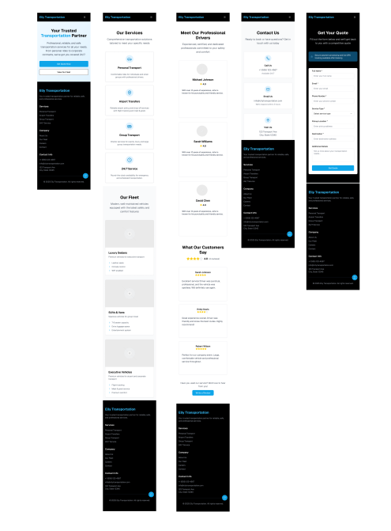

🌐 Project Overview

Elly Transportation is a responsive, multi-page transportation services website built with vanilla HTML5, CSS3, and JavaScript. This project demonstrates modern web development practices including mobile-first design, interactive components, and professional deployment.

Live Website: https://beqqi.github.io/foundations-final-project

🎯 Project Purpose

Elly Transportaion serves as a professional transportation company website that:

    Showcases transportation services and fleet options

    Takes information from customers to calculate quotations

    Features driver profiles and customer testimonials

    Delivers optimal user experience across all devices

📁 Project Structure
Elly Transport/
│
├── index.html              # Homepage
├── services.html           # Services & Fleet Information
├── about.html              # About Us & Driver Profiles
├── contact.html            # Contact Page with Form
├── quote.html              # Interactive Form to Receive Information
│
├── css/
│   └── style.css           # Main stylesheet (mobile-first)
│
├── js/
│   ├── script.js           # Main JavaScript functionality
│
├── images/
    ├── vehicles/           # Fleet vehicle photos
    ├── drivers/            # Driver profile photos
    └── screenshots/        # Project documentation

🚀 Features Implemented
✅ Core Requirements Met:

    5 Responsive Pages with consistent navigation

    Mobile-First Design approach

    Semantic HTML5 structure

    Advanced CSS3 features (Grid, Flexbox, Transitions)

    Interactive JavaScript 

🎨 Design Features:

    Responsive Navigation with hamburger menu on mobile

    Customer Testimonials cards

    Service lists

    Smooth  transitions

⚡ Technical Features:

    CSS Custom Properties for consistent theming

    Form Validation with user feedback

    Performance Optimized images

📱 Pages Overview
1. Homepage (index.html)

    Hero section with call-to-action

    Quick quote call-to-action

2. Services (services.html)

    Services preview with icons 

    Complete fleet showcase with specifications

3. About Us (about.html)

    Customer testimonials

    Driver profiles with photos and bios

    Customer testimonials section

4. Contact (contact.html)

    Company location and map integration

    Service hours and contact information

5. Get Quote (quote.html)

    Quote form with feedback

🛠️ Technologies Used

    HTML5: Semantic markup, accessibility features

    CSS3: Grid, Flexbox, media queries

    JavaScript: DOM manipulation

    Font Awesome: Professional icons

    Google Fonts: Typography system

🌐 Deployment
Hosted on: GitHub Pages

Deployment Steps:

    Repository created at: https://github.com/beqqi/foundations-final-project.git 

    GitHub Pages enabled in repository settings

✅ Photo Credits
      Photo by <a href="https://unsplash.com/@hya14?utm_content=creditCopyText&utm_medium=referral&utm_source=unsplash">HAMZA YOUNAS</a> on <a href="https://unsplash.com/photos/gray-mercedes-benz-suv-on-brown-dirt-road-during-daytime-dLj744XVa2s?utm_content=creditCopyText&utm_medium=referral&utm_source=unsplash">Unsplash</a>
            
      Photo by <a href="https://unsplash.com/@praswinprakashan?utm_content=creditCopyText&utm_medium=referral&utm_source=unsplash">Praswin Prakashan</a> on <a href="https://unsplash.com/photos/a-red-car-parked-on-a-street-dGsf8Y0n2d0?utm_content=creditCopyText&utm_medium=referral&utm_source=unsplash">Unsplash</a>
            
      Photo by <a href="https://unsplash.com/@olav_tvedt?utm_content=creditCopyText&utm_medium=referral&utm_source=unsplash">Olav Tvedt</a> on <a href="https://unsplash.com/photos/white-vehicle-with-blue-neon-headlight-bulb--oVaYMgBMbs?utm_content=creditCopyText&utm_medium=referral&utm_source=unsplash">Unsplash</a>
         
      Photo by Daniel Xavier: https://www.pexels.com/photo/woman-wearing-black-eyeglasses-1239291/ 
      Photo by Justin Shaifer: https://www.pexels.com/photo/photography-of-a-guy-wearing-green-shirt-1222271/
      Photo by Creation Hill: https://www.pexels.com/photo/man-in-red-jacket-1681010/
